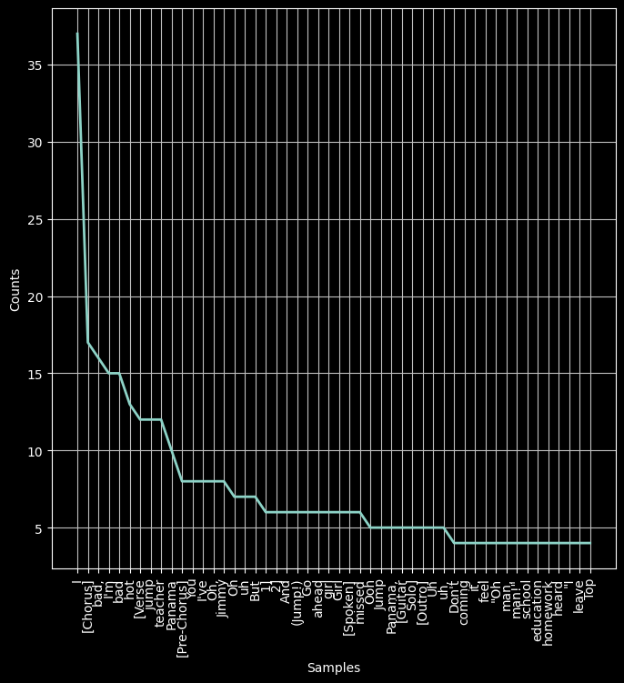
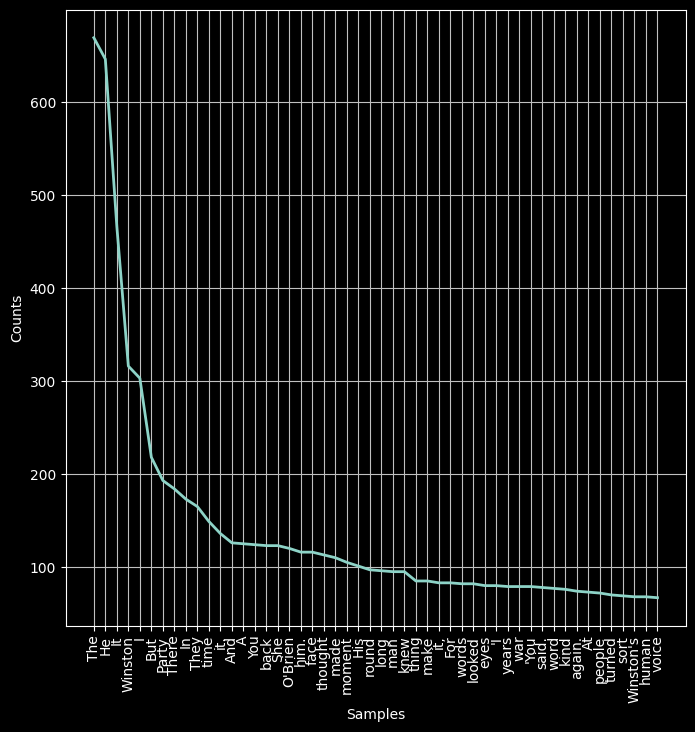
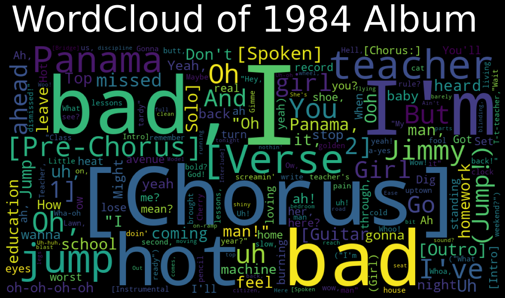
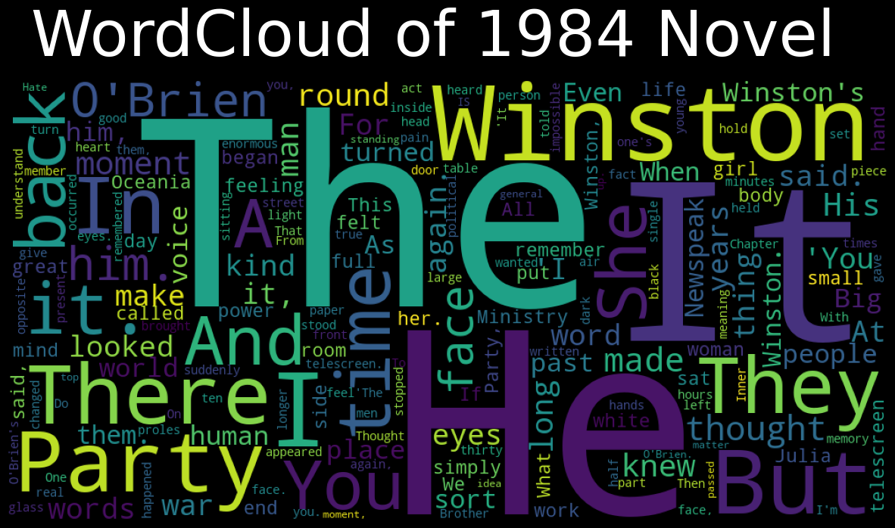

# 1984 Book vs. Album: A Unique NLP Project


## Introduction

In this project, titled "Building a unique NLP project: 1984 book vs 1984 album", we delve into the comparison between two cultural phenomena: "1984", the dystopian social science fiction novel by English novelist George Orwell, and "1984", the sixth studio album by American rock band Van Halen. Leveraging Natural Language Processing (NLP) techniques, we explore various aspects of these two entities, including summarizing text, performing sentiment analysis, and creating word clouds.

## Import the Modules and Libraries

```python
# Import necessary modules and libraries
import os
import pandas as pd
from collections import Counter
from PIL import Image
import numpy
import matplotlib.pyplot as plt
from wordcloud import WordCloud
from sumy.parsers.plaintext import PlaintextParser
from sumy.summarizers.lsa import LsaSummarizer
from sumy.nlp.tokenizers import Tokenizer
from sumy.nlp.stemmers import Stemmer
from sumy.utils import get_stop_words
from nltk.sentiment import SentimentIntensityAnalyzer
import nltk
```

## Data Exploration

```python
# Explore the data for Van Halen's 1984 album
...
```



```python
# Explore the data for George Orwell's 1984 novel
...
```




## Create the WordCloud


```python
# Generate WordCloud of the 1984 Album
...
```



```python
# Generate WordCloud of the 1984 Novel
...
```



## Summarize Text with NLP

```python
# Perform text summarization using NLP
...

# Summarize the 1984 Album
...

# Summarize the 1984 Novel
...
```

## Perform Sentiment Analysis with NLP

```python
# Perform sentiment analysis using NLP
...

# Sentiment Analysis of the 1984 Album
...

# Sentiment Analysis of the 1984 Novel
...
```

## Summary of the Project

This project entailed a comprehensive comparison between George Orwell's novel "1984" and Van Halen's album "1984", utilizing various NLP techniques. The project included textual analysis, word cloud generation, text summarization, and sentiment analysis to provide insights into these two cultural artifacts.
